# Laboratório AWS ELB e Auto Scaling – Arquitetura Escalável

## 📌 Visão Geral
Este laboratório demonstra a criação de uma arquitetura escalável e altamente disponível na AWS utilizando **Elastic Load Balancing (ELB)** e **EC2 Auto Scaling**. O objetivo é distribuir o tráfego de forma eficiente entre múltiplas instâncias EC2 e ajustar automaticamente a capacidade da infraestrutura de acordo com a demanda.

Essa abordagem evita ponto único de falha e permite que a aplicação se adapte automaticamente a variações de carga.

---

## 🎯 Objetivos do Laboratório
Ao final deste laboratório, foi possível:

- Criar uma **Amazon Machine Image (AMI)** a partir de uma instância EC2 existente  
- Configurar um **Application Load Balancer (ELB)** para distribuição de tráfego  
- Criar um **Launch Template** para padronizar a criação de instâncias  
- Implementar um **Auto Scaling Group** com políticas de escalabilidade automática  
- Configurar **alarmes no Amazon CloudWatch** para monitoramento de desempenho  
- Validar o funcionamento do balanceamento de carga e do Auto Scaling  

Esses objetivos demonstram como automatizar disponibilidade, desempenho e escalabilidade na AWS.

## 🏗️ Arquitetura Utilizada
A arquitetura do laboratório é composta pelos seguintes componentes:

- **Amazon VPC (Lab VPC)**  
- **Instâncias EC2** distribuídas em sub-redes privadas  
- **Application Load Balancer (ELB)** em sub-redes públicas  
- **Auto Scaling Group** com capacidade mínima, desejada e máxima  
- **Amazon CloudWatch** para métricas e alarmes  

O ELB recebe o tráfego da internet e o distribui entre as instâncias EC2, enquanto o Auto Scaling ajusta automaticamente a quantidade de instâncias conforme a utilização de CPU.

A separação entre sub-redes públicas e privadas aumenta a segurança da aplicação.

## 1️⃣ Criação da AMI para Auto Scaling

### 📌 Detalhes da AMI
- **Nome da AMI:** WebServerAMI  
- **Descrição:** Lab AMI for Web Server  

### ℹ️ Observação
Essa AMI foi utilizada posteriormente pelo **Auto Scaling Group** para criar novas instâncias automaticamente.

A AMI garante que todas as instâncias criadas pelo Auto Scaling tenham a mesma configuração de sistema e aplicação.

---

## 2️⃣ Criação do Grupo de Destino

Foi criado um **Target Group** para definir o destino do tráfego encaminhado pelo **Load Balancer**.

O Target Group centraliza o controle de quais instâncias podem receber tráfego.

### 📌 Configurações
- **Nome:** LabGroup  
- **Tipo de destino:** Instâncias  
- **VPC:** Lab VPC  

### ℹ️ Função do Target Group
O grupo de destino é responsável por:
- Realizar **health checks**  
- Encaminhar o tráfego apenas para **instâncias saudáveis**

Isso garante que o tráfego seja enviado apenas para instâncias em funcionamento correto.

#### Nome e tipo de destino
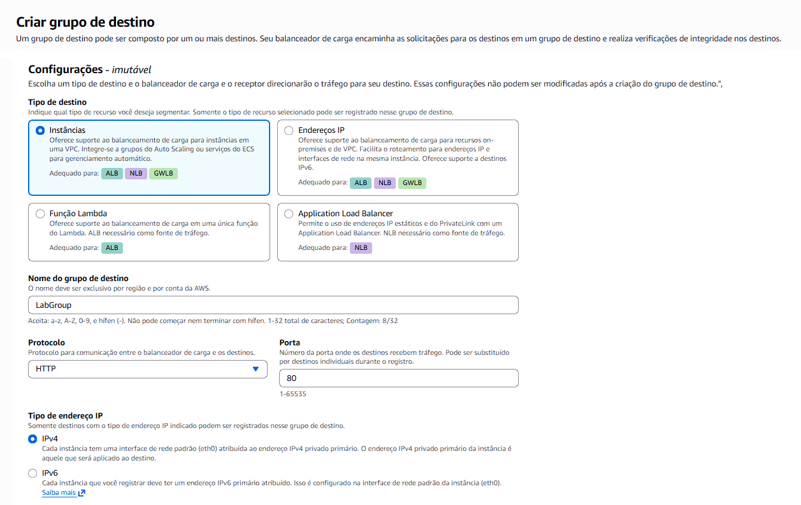

#### VPC associada
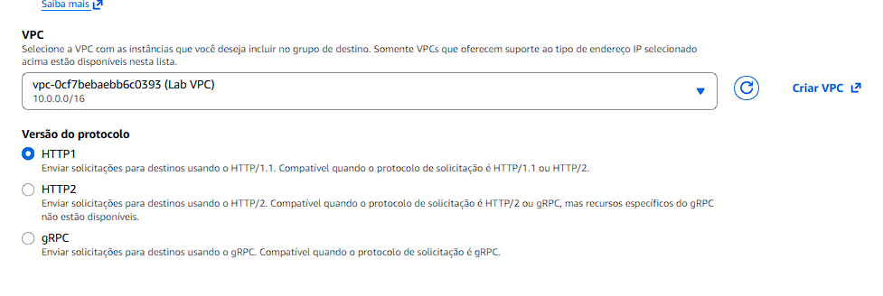

#### Resumo da configuração
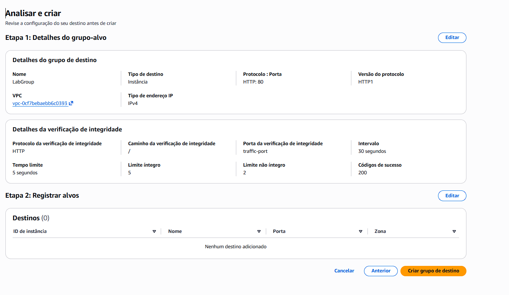

## 3️⃣ Criação do Application Load Balancer (ELB)

Foi configurado um **Application Load Balancer (ALB)** para distribuir o tráfego HTTP entre as instâncias EC2.

O ALB opera na camada 7, permitindo balanceamento eficiente de requisições HTTP.

### 🖼️ Visão geral
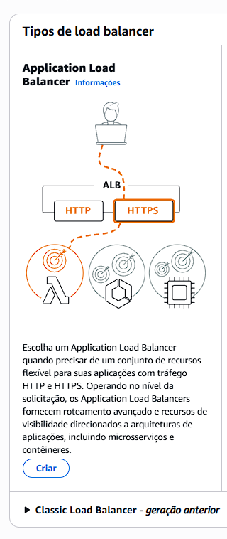

### 📌 Configurações
- **Nome:** LabELB  
- **Tipo:** Internet-facing  
- **VPC:** Lab VPC  
- **Sub-redes:**  
  - Sub-rede pública 1  
  - Sub-rede pública 2  

O ALB é internet-facing para receber tráfego externo e utiliza múltiplas zonas para alta disponibilidade.

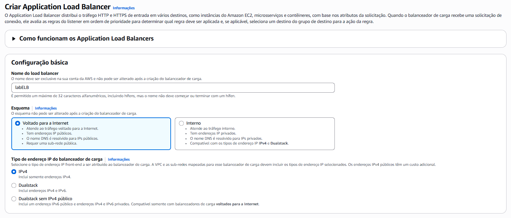  
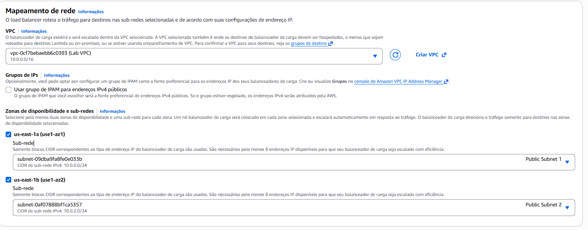

### 🔐 Segurança e Listener
- **Grupo de segurança:** Web Security Group  
- **Listener:** HTTP (porta 80)  
- **Ação padrão:** Encaminhar para o grupo de destino `LabGroup`  

O listener define como o tráfego é recebido e para onde será encaminhado.

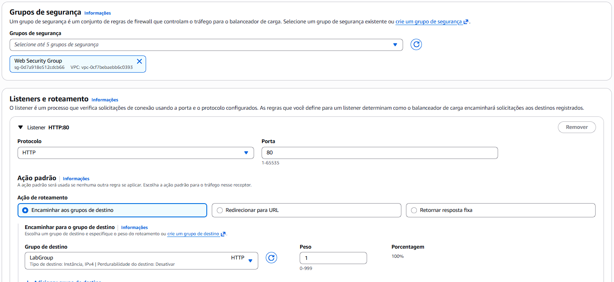

## 4️⃣ Criação do Launch Template

Foi criado um **Launch Template** para padronizar as instâncias do Auto Scaling.

O Launch Template garante consistência na criação de novas instâncias.

### Configurações
- **Nome:** LabConfig  

- **AMI:** WebServerAMI  
- **Tipo de instância:** t2.micro  

A AMI define o ambiente da aplicação e o tipo de instância equilibra custo e desempenho.

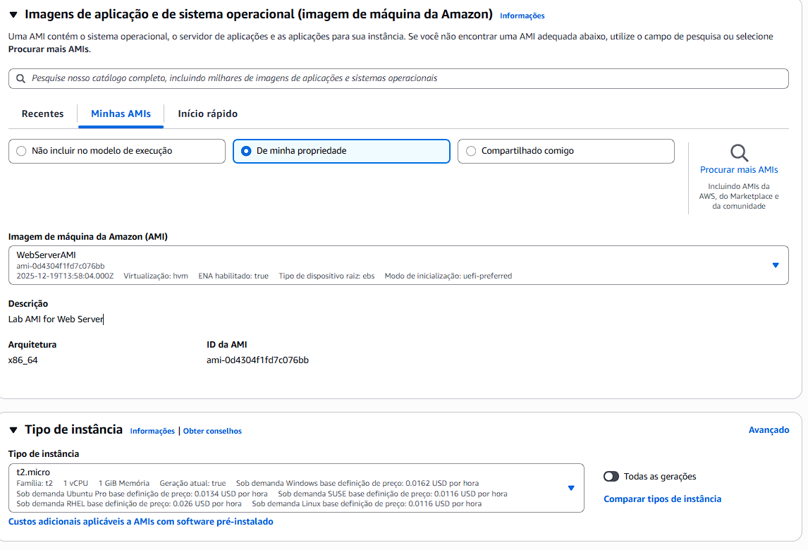

- **Par de chaves:** vockey  
- **Grupo de segurança:** Web Security Group  

Essas configurações garantem acesso seguro e controle de tráfego.

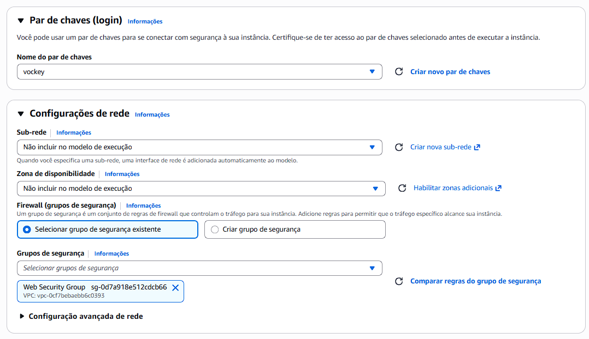

- **Monitoramento detalhado do CloudWatch:** habilitado  

O monitoramento detalhado permite que o Auto Scaling reaja mais rapidamente às variações de carga.

## 5️⃣ Criação do Auto Scaling Group

O **Auto Scaling Group** foi criado utilizando o Launch Template configurado anteriormente.

O Auto Scaling Group é responsável por manter a aplicação disponível automaticamente.

### Configurações Gerais
- **Nome:** Lab Auto Scaling Group  
- **VPC:** Lab VPC  
- **Sub-redes:**  
  - Sub-rede privada 1  
  - Sub-rede privada 2  

As instâncias ficam em sub-redes privadas para maior segurança.

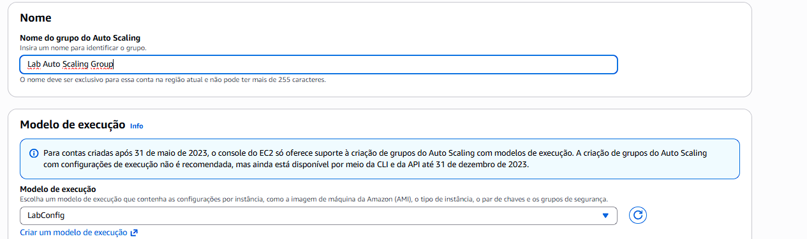  
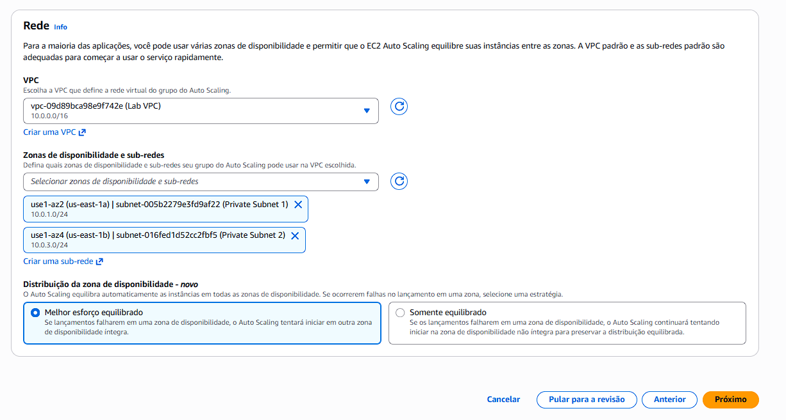

### Capacidade
- **Capacidade desejada:** 2  
- **Capacidade mínima:** 2  
- **Capacidade máxima:** 6  

Esses limites garantem disponibilidade mínima e controle de custos.

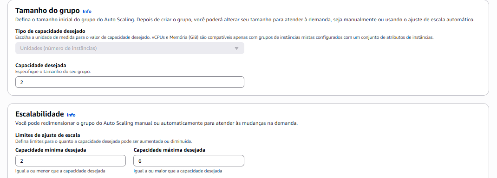

### Política de Escalabilidade
- **Nome:** LabScalingPolicy  
- **Métrica:** Utilização média da CPU  
- **Valor alvo:** 60%  

A política ajusta automaticamente a quantidade de instâncias conforme a carga da aplicação.

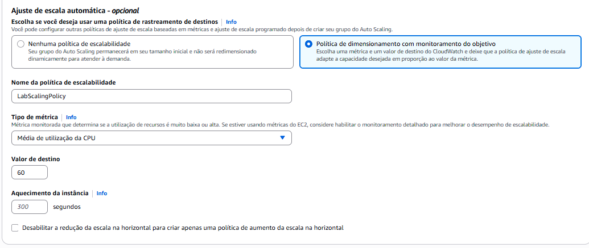

O Auto Scaling ajusta automaticamente o número de instâncias para manter a CPU média próxima ao valor definido.

### Configurações adicionais
Hábilitado coletas de métricas do CloudWatch.

- **AlarmHigh:** Aciona quando a CPU ultrapassa o valor definido  
- **AlarmLow:** Reduz instâncias quando a carga diminui  

Os alarmes permitem que o escalonamento ocorra sem intervenção manual.

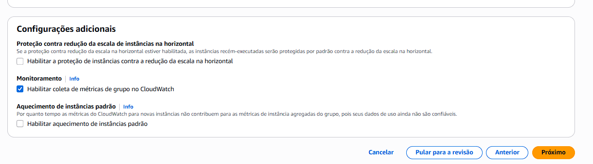

## 🏗️ Arquitetura da Configuração Final

A imagem abaixo representa a arquitetura final da infraestrutura configurada na AWS, incluindo **Load Balancer**, **Auto Scaling Group**, **Target Group** e **instâncias EC2 distribuídas em sub-redes privadas**.

Essa arquitetura final atende aos requisitos de escalabilidade, alta disponibilidade e tolerância a falhas do laboratório.

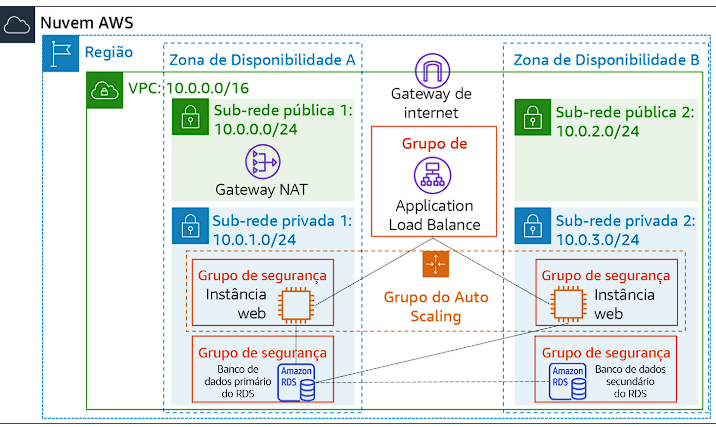

